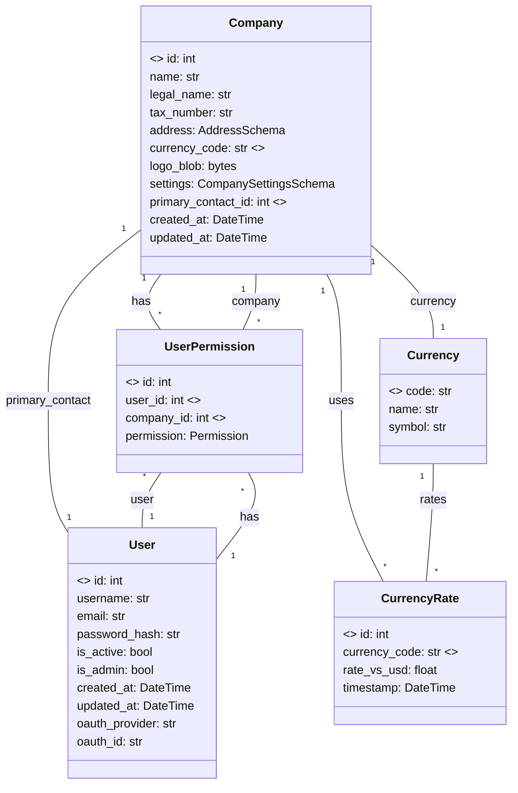

# Database Relationships

This document describes the core SQLAlchemy relationships in the pyledger backend. The diagram below uses Mermaid syntax for easy visualization and maintenance.

## Entity Relationship Diagram

## Relationship Details

- **Company**
  - `user_permissions`: relationship to `UserPermission` (back_populates="company")
  - `users`: association proxy via `user_permissions`
  - `currency`: relationship to `Currency`
  - `primary_contact`: relationship to `User`
- **User**
  - `user_permissions`: relationship to `UserPermission` (back_populates="user")
  - `companies`: association proxy via `user_permissions`
- **UserPermission**
  - `user`: relationship to `User` (back_populates="user_permissions")
  - `company`: relationship to `Company` (back_populates="user_permissions")
- **Currency**
  - `rates`: relationship to `CurrencyRate` (back_populates="currency")
- **CurrencyRate**
  - `currency`: relationship to `Currency` (back_populates="rates")

## Foreign Keys
- `UserPermission.user_id` → `User.id`
- `UserPermission.company_id` → `Company.id`
- `Company.currency_code` → `Currency.code`
- `Company.primary_contact_id` → `User.id`
- `CurrencyRate.currency_code` → `Currency.code`

## Relationship & Reference Philosophy

- **Bidirectional relationships:** For all many-to-one and one-to-many relationships, we use `back_populates` on both sides to ensure SQLAlchemy can synchronize changes and allow traversal in both directions. This is especially important for join tables and permission models.
  - *Example (one-to-many):* `Company` <-> `UserPermission` — a company can have many user permissions, and each user permission belongs to one company. Both sides use `back_populates`.
  - *Example (many-to-one):* `UserPermission` <-> `User` — a user can have many permissions, each permission belongs to one user. Both sides use `back_populates`.
- **Unidirectional relationships:** For simple references (e.g., a company’s currency or primary contact), we use unidirectional relationships unless there is a clear need to traverse from the referenced entity back to the parent. This keeps the model simple and avoids unnecessary complexity.
  - *Example (one-to-one):* `Company.primary_contact` — a company references a single user as its primary contact, but the user does not have a direct reference back to the company.
  - *Example (many-to-one, unidirectional):* `Company.currency` — a company references a single currency, but the currency does not reference all companies using it.
- **Association proxies:** Where appropriate, we use association proxies to expose related objects directly (e.g., `Company.users` via `user_permissions`).
- **Naming conventions:** We use plural names for collections and singular for references. All relationships are explicitly named and use `back_populates` for clarity.
- **Foreign keys:** All foreign key columns are clearly marked and referenced in the diagram and code.

*When in doubt, prefer explicit bidirectional relationships for join tables and permissions, and unidirectional for simple references.*

---

*Update this diagram and list as you add or change relationships in the models.*
